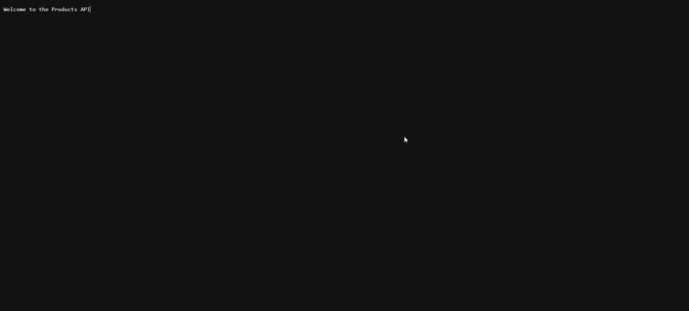

<h1 align="center">Products API-Rest Project</h1>



<!-- 
<p align="center">
  <a href="https://github.com/isabelleysseric/ProductsApiRestProject">ProductsApiRestProject</a> (GitHub)
  &nbsp; • &nbsp;<a href="https://github.com/isabelleysseric/ProductsApiRestProject/wiki">ProductsApiRestProject</a> (Wiki)<br/>
  <a href="https://github.com/isabelleysseric">isabelleysseric</a> (GitHub)
  &nbsp; • &nbsp;<a href="https://isabelleysseric.com/">isabelleysseric.com</a> (Portfolio)
  &nbsp; • &nbsp;<a href="https://isabelleysseric.ai/">isabelleysseric.ai</a> (Projects)
  &nbsp; • &nbsp;<a href="https://www.linkedin.com/in/isabelleysseric/">isabelleysseric</a> (LinkedIn) <br/>
</p>
<br/>
-->
<h2 align="center">    

  <!-- Project Repo -->
  <a href="https://github.com/isabelleysseric/">
    
  </a>

  <!-- Wiki Project -->
  <a href="https://github.com/isabelleysseric/">
    
  </a>
    
  <!-- GitHub -->
  <a href="https://github.com/isabelleysseric/">
    
  </a><br>
    
  <!-- AI Page -->
  <a href="https://isabelleysseric.ai/">
    
  </a>
    
  <!-- Portfollio -->
  <a href="https://isabelleysseric.com/Resume.html">
    
  </a>
    
  <!-- LinkedIn -->
  <a href="https://www.linkedin.com/in/isabelleysseric/">
    
  </a>
  
  <!-- Docker Hub -->
  <a href="https://hub.docker.com/u/isabelleysseric">
    
  </a>

  <!-- Gazebo Sim -->
  <a href="https://hub.docker.com/u/isabelleysseric">
    
  </a>
  
  <!-- GMAIL -->
  <a href="mailto: isabelleysseric@gmail.com">
    
  </a><br/><br/>
  
</h2>


## Author
[Isabelle Eysseric](https://github.com/isabelleysseric)
<br/>
<br/>


## Project description

Products Api Rest Project is a RESTful API built with ASP.NET Core that allows you to manage two main entities: `Products` and `Items`. This project also includes complete documentation generated with Sphinx, available in multiple formats, including HTML and PDF.


## Table of Contents

- [Features](#features)
- [Installation](#installation)
  - [Prerequisites](#prerequisites)
  - [Clone the Repository](#clone-the-repository)
  - [Install Dependencies](#install-dependencies)
- [Usage](#usage)
  - [API Endpoints](#api-endpoints)
  - [Request Examples](#request-examples)
- [Generating Documentation](#generating-documentation)
  - [HTML Documentation](#html-documentation)
  - [PDF Documentation](#pdf-documentation)
- [Project Structure](#project-structure)
- [Contributing](#contributing)
- [License](#license)


## Features

- **Item Management**:
  
  - Retrieve all items
  - Retrieve a specific item by ID
  - Add a new item
  - Update an existing item
  - Delete an item

- **Product Management**:
  
  - Retrieve all products
  - Retrieve a specific product by ID
  - Add a new product
  - Update an existing product
  - Delete a product

- **Documentation**:
  
  - Project documentation generated with Sphinx.
  - Available formats: HTML, PDF.


## Installation

### Prerequisites

- [.NET Core SDK](https://dotnet.microsoft.com/download)
- [Python 3.x](https://www.python.org/downloads/) and [pip](https://pip.pypa.io/en/stable/installation/)
- [Sphinx](https://www.sphinx-doc.org/en/master/) and [sphinx-intl](https://sphinx-intl.readthedocs.io/en/latest/) (for documentation)
- [MikTeX](https://miktex.org/download) (Windows) or [TeX Live](https://www.tug.org/texlive/) (Linux/macOS) for PDF generation

### Clone the Repository

```bash
git clone https://github.com/your-username/ProductsApiRestProject.git
cd ProductsApiRestProject
```

### Install Dependencies

Install .NET Dependencies:

```bash
dotnet restore
```

Install Python Dependencies for Sphinx:

```bash
pip install -r requirements.txt
```


## Usage

To start the API, run the following command:

```bash
dotnet run
```

The API will be accessible at `http://localhost:5000`.

### API Endpoints

#### Items

| Method | Endpoint          | Description                    |
| ------ | ----------------- | ------------------------------ |
| GET    | `/api/items`      | Retrieve all items             |
| GET    | `/api/items/{id}` | Retrieve a specific item by ID |
| POST   | `/api/items`      | Add a new item                 |
| PUT    | `/api/items/{id}` | Update an existing item        |
| DELETE | `/api/items/{id}` | Delete an item                 |

#### Products

| Method | Endpoint             | Description                       |
| ------ | -------------------- | --------------------------------- |
| GET    | `/api/products`      | Retrieve all products             |
| GET    | `/api/products/{id}` | Retrieve a specific product by ID |
| POST   | `/api/products`      | Add a new product                 |
| PUT    | `/api/products/{id}` | Update an existing product        |
| DELETE | `/api/products/{id}` | Delete a product                  |

### Request Examples

#### Retrieve All Items

```bash
curl -X GET http://localhost:5000/api/items
```

#### Add a New Product

```bash
curl -X POST http://localhost:5000/api/products \
-H "Content-Type: application/json" \
-d '{
  "name": "New Product",
  "description": "This is a new product",
  "price": 19.99
}'
```


## Generating Documentation

### HTML Documentation

To generate the documentation in HTML format:

```bash
sphinx-build -b html source/ _build/html
```

The HTML files will be available in the `_build/html` directory.

### PDF Documentation

To generate the documentation in PDF format, make sure you have a LaTeX distribution installed (MikTeX or TeX Live).

```bash
sphinx-build -b latex source/ _build/latex
cd _build/latex
pdflatex ProductsApiRestProject.tex
```The PDF file will be generated in the `_build/latex` directory.
```


## Project Structure

```
ProductsApiRestProject/
│
├── doc/
│   └── locale/
│       ├── .doctrees/
│       ├── en/
│       ├── fr/
│       ├── index.pot
│       ├── installation.pot
│       └── usage.pot
│
├── source/
│   ├── _static/
│   ├── _templates/
│   ├── conf.py
│   ├── index.rst
│   ├── installation.rst
│   └── usage.rst
│
├── Controllers/
│   ├── HomeController.cs
│   ├── ItemsController.cs
│   └── ProductsController.cs
│
├── Models/
│   ├── ItemDto.cs
│   └── ProductDto.cs
│
├── Services/
│   ├── ItemService.cs
│   ├── IItemService.cs
│   ├── ProductService.cs
│   └── IProductService.cs
│
├── wwwroot/
│   └── favicon.ico
│
│── .gitignore
│── make.bat
├── Makefile
├── ProductsApiRestProject.csproj
├── Startup.cs
├── Program.cs
└── README.md
```

This `README.md` file is designed to be comprehensive and user-friendly, providing all the necessary information to install, use, and contribute to `MyApiProject`.


## Contributing

Contributions are welcome! To contribute:

1. Fork the repository.
2. Create a new branch for your feature (`git checkout -b feature/your-feature`).
3. Commit your changes (`git commit -am 'Add a new feature'`).
4. Push the branch (`git push origin feature/your-feature`).
5. Create a Pull Request.

Please follow the coding conventions and document your changes.


## License

This project is licensed under the MIT License. See the [LICENSE](https://github.com/isabelleysseric/ProductsApiRestProject/blob/master/LICENSE) file for details.


